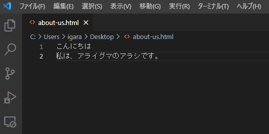
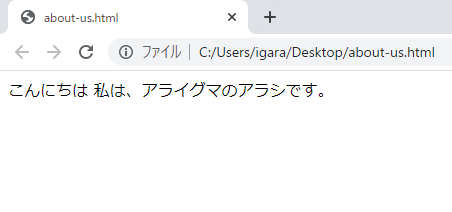
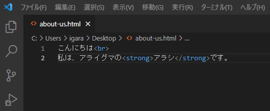
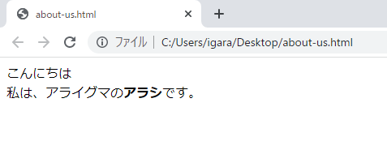

# STEP-1.HTMLの基本

この章では、HTMLを書いてブラウザに文字を表示させるところまで学びます。

自己紹介ページを作っていきましょう。

## 1.ブラウザに文字を表示させる

実は、文字を表示させるだけならすぐできます。

### 1-1.VSコードに文字を打ってみよう

VSコードを起動し新規ファイルを作成します。

［ファイル］→［新規作成］を選んで、以下の文字を打ってみましょう。「こんにちは」のうしろで`Enter`を押して改行するのがポイントです。

```html
こんにちは
私は、アライグマのアラシです。
```

こんな感じですね。



### 1-2.ファイルを保存すする

［ファイル］→［保存］を選択し、ファイル名を［about-us.html］と入力し、デスクトップなど自分がわかりやすい場所に保存してください。

### 1-3.保存したファイルをブラウザで開く

保存したファイルをダブルクリックしてGoogle Chromeで開きます。



保存した文字が表示されたら成功です。

あれ？

改行が反映されていません。なぜでしょうか？

実は、コンピュータに対して「ここが改行だよ」と示してあげなければならないのです。そう！その指示がHTMLです。次にそれを解説していきます。

## 2.HTMLとは

HTMLは［マークアップ言語］と呼ばれます。

入力した文字に「意味のあるコード」を付けることによってコンピュータに指令を送ります。先程、改行が反映されていいませんでしたよね？

改行や強調表示、箇条書きなど様々な効果は、コンピュータに分かるように入力してあげないといけないのです。そうです、その記法（文法）がHTMLというわけです。

### 2-1.マークアップ

文字に「意味のあるコード」を付けることをマークアップと言います。

例えば、改行を意味する`<br>`、強調表示は`<strong>`と`</strong>`で囲う…という風にコードを記載することでコンピュータが認識してくれます。

### 2-2.マークアップしてみる

さっそく先程のコードに追記してみましょう。

改行コードは`<br>`です。ついでに強調を意味する`<strong>`も付けてみます。

```html
こんにちは<br>
私は、アライグマの<strong>アラシ</strong>です。
```

こんな感じになります。



`Ctrl + S`同時押しで保存してください。

### 2-3.ブラウザで確認

先程のファイルをブラウザで開いたままであれば、ブラウザ上で`Ctrl + R`同時押しで更新ができます。



改行、強調表示されたら成功です。

> `Ctrl + S`や`Ctrl + R`など、ショートカットキーは大変便利です。慣れるまで大変ですが、作業の効率が上がるので積極的に使っていきましょう！

### 2-4.マークアップの種類

`<br>`のように単体で使うものや、`<strong> *** </strong>`のように`/`で閉じるものがあります。

特によく使うものは以下です。

```html
<h2>～</h2> -> 見出し2
<p>～</p> -> 段落
<ul>～</ul> -> 箇条書き
```

#### 属性と属性値について

リンクのように`付加情報`を書くものがあります。付加情報とその内容のことを`属性`と呼びます。

```html
<a href="https://google.co.jp">グーグルです</a>
```

> 結果 -> [グーグルです](https://google.co.jp)

* `href` = **属性名**
* `"　"`内の`https://google.co.jp` = **属性値**

## 3.HTMLとCSSのルール

HTMLとCSSの仕様書は以下でチェックできます。

- HTML：https://html.spec.whatwg.org/multipage/
- CSS：https://www.w3.org/Style/CSS/

### 3-1.HTML

HTMLはもともとW3Cという団体が仕様の策定をし、HTML4・HTML5というようにバージョンごとに名前がついていましたが、2019年5月ごろにWHATWGという団体のHTML Living Standardという仕様に一本化しました。

### 3-2.CSS

W3Cが策定を行っていますが、細かい単位で仕様策定が進んでおり、Level3は一般的に`CSS3`とよばれ、2021年2月現在ではCSS Level4が進んでいます。

### 3-3.HTMLのルール

- 開始タグから終了タグまでのひとかたまりを`要素`呼びます
- タグはすべて半角英数です。

STEP-2へ -> [HTMLを書いてみよう！](STEP-2.md)
