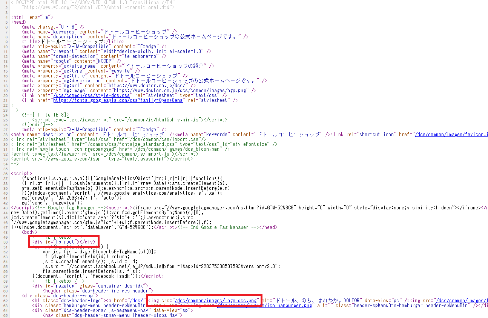

# STEP-2.HTMLで簡単なページをつくる

HTMLに触れてみてどうでしたか？

なんだか難しそう…と思うかも知れませんが、今あなたが見ているこの画面も、YouTubeも、Amazonも世の中にあるウェブサイトはがHTMLで書かれています。

実は、ブラウザには見ているサイトがどんなコードで書かれているのか**分析できる便利な機能**があります。その機能を使うことで「このサイトはどうやって作っているのだろう？」と、お手本をみることができるのです。

そのコードを丸々コピペしても良いのです。

大変便利な機能なので、ひとまず、サイトを解析する方法を試してみませんか？

## 1.サイトを解析してみる

参考に、ドトールのサイトをのぞいてみましょう。（競合分析も大事ですね！）

https://www.doutor.co.jp/dcs/


### 1-1.ページソースの表示

ページを開いて画面上で［右クリック］→［ページのソースを表示］を押してください。（`Ctrl + U`同士押しでもできます。）


すると、こんな画面がでてきます。



ここに書いてある紫文字が`<div>`や` ［検証］をクリックします。（ショートカットキーは`F12`です！）


右側にウィンドウが表示されます。


`➤`で親要素ごとに集約されていて、`➤`をクリックすると子要素が表示されます。


コードをスッキリ表示してくれています。

サイト作りでは、検証ツールが必要不可欠になってきます。

ぜひ、いろんなサイトを解析してみてください。

## 2.HTMLの構造

それでは、コードを書いていきましょう。

HTMLは以下の２点で構成されていますので、それそれ書いていきます。

- head = コンピュータ向けの情報で画面上に表示されない
- body = 画面上に表示されるメイン部分

### 2-1.head

`head`はブラウザ上に表示されませんが、コンピュータに「ファイルの情報」を渡す重要な部分です。はじめに設定しておきましょう。 

ほとんどが定型的な記述になりますのでコピペOKです。覚える必要はありません。

どんな役割をもっているのかだけ掴んでいただけたらと思います。

### 2-2.body

画面上に表示される部分を記述します。

`body`の中には`heaer`（上部のメニューバー）などあるので`head`と混同しないよう気を付けてください。

#### 2-3.コードを書く

簡単なhtmlファイルを書いてみましょう。

以下のコードをコピペでOKです。

```html
<!DOCTYPE html> <!-- HTMLのバージョン指定 -->
<html lang="ja"> <!-- 属性で言語を日本語に指定 -->

<head>
  <meta charset="utf-8"> <!-- 文字コードの指定 -->
  <title>My test page</title> <!-- タイトル -->
</head>

<body>
こんにちは<br>
私は、アライグマの<strong>アラシ</strong>です。
</body>

</html>
```
> htmlでは`<!--`と`-->`で囲った部分は「コメントアウト」することができます。コメントをすることによって、自分への備忘録や、第三者が見た時にわかるようコメントを入れることも実務上よくあります。

VSコードで先程書いた［about-us.html］ファイルに、上記のコードを上書きして、Google Chromeで開いてみてください。


#### head部分を解析してみる

しかし、`head`部分はどこにいったのでしょうか？

［検証ツール］で中身をみてみましょう。


ちゃんと認識されています。

`head`はコメントで書いているとおり、ブラウザに対して［バージョン］［文字コード］［タイトル］など「このサイト（ファイル）はどんな形式で書いています。」ということをコンピュータに知らせるために書いています。

> 実はタイトルはブラウザにこっそり表示されています。それはブラウザ一番上のタブ部分です。
> 
> 

#### 基本的な注意点

* １字でもタイプミスがあると上手く表示されません。
* 開始タグと閉じタグはキチンと合わせます。

## 3.自己紹ページを作る

アラシ君から以下のような自己紹介文をもらいました。

```html
店舗紹介

名前：カフェ なないろ

人里はなれた村の、そのまた外れにある隠れたカフェ…。
旅人がほっと一息、疲れを癒す憩いの場所です。

お店の住所：山中１丁目谷底1-18-204

店長紹介

こんにちは。
アライグマのアラシと申します。

小さい頃からの夢だった、カフェをオープンしました。

皆さんがくつろげる、楽しい空間にしていきたいと思います。
おしゃべりや勉強、お友達とでも、おひとり様でも大歓迎です。

こだわりのカフェラテは、ミルクたっぷりの濃厚な味わいとなっています。

ぜひ立ち寄ってみてください！

経歴
・1991年生まれ
・北海道育ち
・好きな食べ物：リンゴ

個人的イチオシメニュ～
カフェラテにすりおろしリンゴとハチミツをin！！
バツグンです！
ぜひ試してみてください！
```

さっそくマークアップしていきましょう。

### 3-1.マークアップマークアップしてみる

* 段落
* 見出し
* リンク
* 画像
* 強調
* 表

#### 段落


#### 見出し

見出し


#### リンク
#### 画像
#### 強調
#### 表
